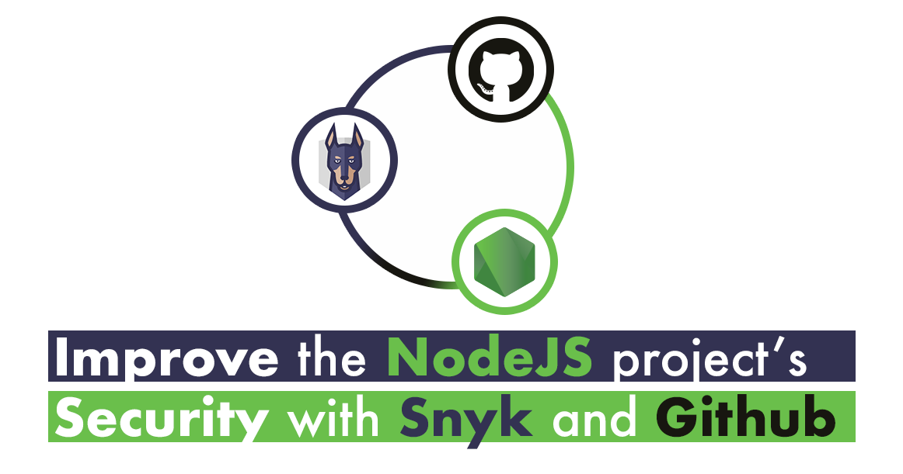

<p align="center">
  
</p>

<h1 align="center">Tutorial Improve the Security of your NodeJS projects with Snyk and Github</h1>

<p align="center">In this tutorial I want to show you how to link your <strong>Github</strong> account with <strong>Snyk</strong> and improve the security of your <strong>NodeJS</strong> projects.</p>

<p align="center">
  <a title="MIT License" href="LICENSE.md">
    
  </a>
  <a title="Twitter: JoseJ_PR" href="https://twitter.com/JoseJ_PR">
    
  </a>  
  <a title="Github: Sponsors" href="https://github.com/sponsors/JoseJPR">
    
  </a>
  <br />
  <br />
</p>

<!--
<p align="center">
  
</p>
-->

## 🔖 Description

In this tutorial I want to show you how you can link your **Github** account with **Snyk** and improve the security of your **NodeJS** projects by following the instructions that Snyk shows you.

## ✅ Prerequisites

In order to work with this project, your local environment must have at least the following versions:

* NodeJS Version: 14.7.x
* NPM Version: 6.14.x

## 📐 How to work with this project in Snyk and Github

First of all you must have create a user account in **[Snyk](https://app.snyk.io/login)** with your **Github** account.

1️⃣ In this tutorial you can see that we have these dependencies in the "package.json" file:

```json
"dependencies": {
  "express": "4.14.0",
  "jsonwebtoken": "7.2.0",
  "moment": "2.16.0"
}
```

2️⃣ If we try remove this vulnerabilities adding the circumflex character, we can see that the express and moment vulnerabilities disappear, but not in jsonwebtoken:

```json
"dependencies": {
  "express": "^4.14.1",
  "jsonwebtoken": "^7.2.1",
  "moment": "^2.16.0"
}
```

In the following link you can read more info about [Semantic Versioning](https://docs.npmjs.com/about-semantic-versioning)

3️⃣ If we update them by these others or higher versions, the vulnerabilities will disappear:

```json
"dependencies": {
  "express": "4.17.1",
  "jsonwebtoken": "8.5.1",
  "moment": "2.24.0"
}
```

### 📹 Demos with VSCode

The following video shows how you can create a Snyk Account with Github.

[](https://youtu.be/xxx)

How the circumflex ^ can to resolver severals vulnerabilities of our proyects.

[](https://youtu.be/xxx)

We can remove all vulnerabilities by reviewing the dependencies and updating them to a higher version.

[](https://youtu.be/xxx)

## 📂 Code Scaffolding

```any
/
├── assets 🌈                   # Images Sources.
├── src 📦                      # All Apps with demos.
|   ├── example-import          # Demo with express dependence.
|   ├── example-jsonwebtoken    # Demo with jsonwebtoken dependence.
|   ├── example-moment          # Demo with moment dependence.
|   └── ...
└── ...
```

## ⛽️ Review and Update Sependencies

For review and update all npm dependencies of this project you need install in global npm package "npm-check-updates" npm module.

```bash
# Install and Run
$npm i -g npm-check-updates
$ncu
```

## License

[MIT](LICENSE.md)

## Happy Code

Created with JavaScript, lot of ❤️ and a few ☕️

## This README.md file has been written keeping in mind

[GitHub Markdown](https://guides.github.com/features/mastering-markdown/) \
[Emoji Cheat Sheet](https://www.webfx.com/tools/emoji-cheat-sheet/)
